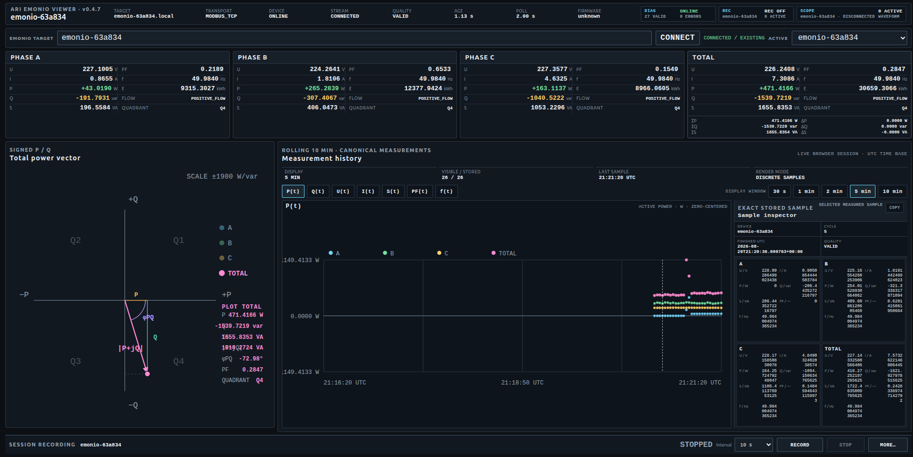

# ARI Emonio Viewer

Local Linux measurement viewer for Emonio P3 devices.

The trusted field baseline is **v0.4.14**.
**v0.4.16 Testing** adds the continuous Negative-Condition Monitor for exact canonical `P < 0`, `PF < 0`, or `P < 0 OR PF < 0` evidence on Phase A, B, and C. The monitor starts one recording when the first selected negative condition is observed, keeps the same session while conditions overlap, stops a monitor-owned session when all selected conditions clear, and then waits automatically for the next event. Exact transitions are never inferred across missing evidence.

The v0.4.15 P-Q Density Map remains a browser-only visualization of exact canonical P/Q history samples. It uses the selected 30 s, 1 min, 2 min, 5 min, or 10 min history window and a fixed 32×32 deterministic grid. It does not smooth, interpolate, resample, or modify measured values.

Tested device firmware: `3.0.79-release`.



## Measurement paths

- Modbus/TCP: read-only canonical A/B/C/TOTAL measurements
- Measurements: U, I, P, Q, S, PF, frequency, energy
- Signed P/Q with four-quadrant representation
- Negative-Condition Monitor for exact per-phase P/PF event recording
- P-Q Density Map from exact canonical browser-history samples only
- 30 s, 1 min, 2 min, 5 min, and 10 min history windows
- Exact stored samples only
- Multi-device runtime isolation
- Per-device session recording
- Read-only device evidence: KWH IN/OUT, CONNECTED A/B/C, ERROR, WARNING
- Read-only CT configuration evidence through Telnet
- SCOPE waveform acquisition with received per-phase metadata
- SCOPE-derived instantaneous phase power `p[k] = u[k] * i[k]` for A/B/C visualization

## Scientific boundary

- No Modbus write path
- One runtime owner for the Modbus/TCP client
- Auxiliary Modbus evidence reads occur only at canonical cycle boundaries
- Reset-on-read MIN/MAX register ranges are not read
- Canonical Modbus measurements and SCOPE data remain separate sources
- Negative-condition decisions use exact canonical measurement values only
- No smoothing, averaging, interpolation, resampling, gap filling, synthetic samples, sign correction, or waveform reconstruction
- Invalid or non-finite SCOPE captures fail closed
- Credentials are runtime-only and are not stored
- SCOPE-derived instantaneous power is visualization-only and does not replace canonical Modbus P

See [SECURITY.md](SECURITY.md) and [CONTRIBUTING.md](CONTRIBUTING.md).

## Requirements

- Python >= 3.10
- `aiohttp==3.14.3`
- `yarl==1.24.2`

## Install

```bash
python3 -m venv .venv
source .venv/bin/activate
python3 -m pip install --upgrade pip
python3 -m pip install -e '.[dev]'
```

## Start

```bash
./start-emonio-viewer.sh
```

Default server binding: `127.0.0.1`.

## Acceptance

```bash
./tools/ari-emonio-acceptance.sh
```

The acceptance script executes unit, integration, frontend, read-only, Python compilation, and scientific sign-path gates.

## License

Source-available software. See [LICENSE](LICENSE).
