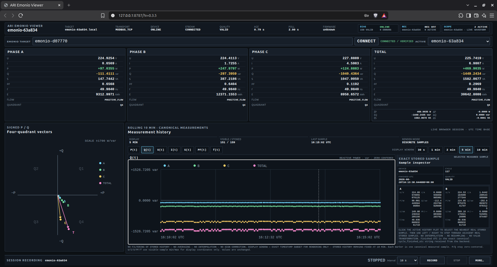
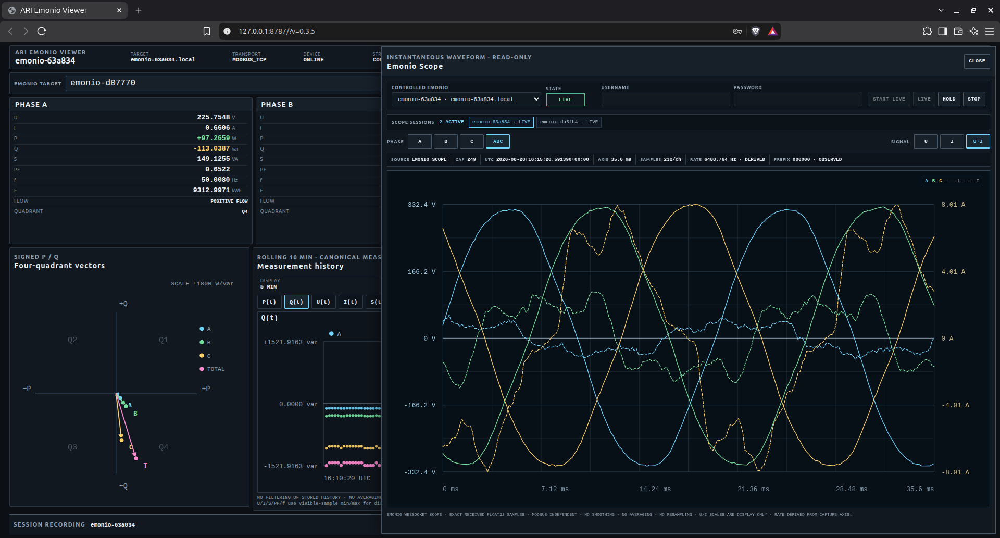

# ARI Emonio Viewer

ARI Emonio Viewer is a local Linux measurement viewer for Emonio P3 devices.
It provides live three-phase measurements, history, recording, multi-device use,
and a separate SCOPE waveform view.

The trusted field baseline is **v0.3.8**. **v0.3.9 Candidate** is the current
public-source candidate and keeps the v0.3.4 stability hardening.

Tested hardware evidence currently covers Emonio P3 firmware `3.0.79-release`.
This is not a claim of universal firmware or hardware compatibility.





## Features

- Phase A/B/C/TOTAL U, I, P, Q, S, PF, frequency, and energy
- signed P/Q with four-quadrant display
- selectable 30 s, 1 min, 2 min, 5 min, and 10 min history windows
- exact-sample inspection and keyboard stepping
- multi-Emonio runtime connection and isolation
- session recording
- read-only CT configuration evidence
- Emonio SCOPE waveform viewer

## Safety and scientific boundaries

- Modbus/TCP is read-only. There is no Modbus write path.
- Canonical Modbus measurements and SCOPE waveforms are separate sources.
- SCOPE uses exact received samples only.
- No smoothing, averaging, interpolation, resampling, gap filling, synthetic
  samples, sign correction, or waveform reconstruction is used.
- Invalid or non-finite SCOPE captures fail closed.
- SCOPE credentials and CT passwords are runtime-only and are not stored.

See [SECURITY.md](SECURITY.md) for the security boundary and
[CONTRIBUTING.md](CONTRIBUTING.md) for development rules.

## Install

Python 3.10 or newer is required.

```bash
python3 -m venv .venv
source .venv/bin/activate
python3 -m pip install --upgrade pip
python3 -m pip install -e '.[dev]'
```

The qualified dependency set includes:

- `aiohttp==3.14.3`
- `yarl==1.24.2`

## Start

```bash
./start-emonio-viewer.sh
```

The viewer opens on localhost. Enter the Emonio IP address or hostname in the
`EMONIO TARGET` field and select `CONNECT`.

The public default configuration contains only a disabled documentation device
at `192.0.2.10`. Keep real local configuration out of Git.

## SCOPE

Open the `SCOPE` drawer, enter the Emonio web username and password, and select
`START LIVE`. Credentials are used only for the active runtime session.

Field-qualified waveform structure for firmware `3.0.79-release`:

- channels `0..5`
- 232 Float32 samples per channel
- 932 bytes per waveform frame
- 35.6 ms capture duration
- derived display-axis rate `6488.764045 Hz`

Channel mapping is A current, A voltage, B current, B voltage, C current,
C voltage. The first three frame bytes are observational evidence only and are
not a universal validity signature.

## Recording

Recordings are written below `recordings/` as session metadata, measurements,
and events. Missing measurements are recorded as events, not fabricated rows.

## Tests

Run the complete acceptance suite with:

```bash
./tools/ari-emonio-acceptance.sh
```

The suite covers unit, integration, frontend, read-only source, Python
compilation, and scientific sign-path gates. Software tests do not replace
real-device qualification.

## License

ARI Emonio Viewer is **source-available** software.

Natural persons may use it free of charge under the included [LICENSE](LICENSE),
including use in their own commercial activity. A company or another separate
commercial legal entity requires a commercial license.

This is not an OSI-approved open-source license.
